# Prototype: AI-Driven, Token-Based UI Kit

This project is a proof-of-concept (PoC) demonstrating a workflow for building a UI Kit where React components are generated directly from design system tokens, with heavy reliance on AI agents to automate the development process.

## Core Concept

The goal of this prototype is to showcase how to minimize the gap between design and development by automating routine tasks and ensuring UI consistency.

The key concepts are:

1.  **Single Source of Truth**: Tokens created in **Token Studio** are the sole source of truth for all visual properties (colors, typography, spacing, etc.).
2.  **Automated Transformation**: Tokens are automatically transformed into code used for component styling. This eliminates errors from manual style transfer.
3.  **AI-Assisted Development**: The process of creating new components, conducting reviews, and managing tasks is heavily automated using specialized AI agents, reducing development time and cognitive load on the team.

## The Technology Workflow

The process is designed as a pipeline that transforms design decisions into ready-to-use UI components.

```mermaid
graph TD
    A[🎨 Token Studio] -- Export tokens --> B{"Git Repository (/tokens)"};
    B -- Run build script --> C[⚙️ Style Dictionary];
    C -- Generates --> D["📝 Vanilla Extract Contracts & Themes"];
    D -- Used in --> E["⚛️ React Components (based on Base UI)"];
    E -- Displayed in --> F[📚 Storybook];
```



1.  **Design Tokens**: Designers work in Figma with the **Token Studio** plugin. When complete, tokens are synced to the project's Git repository as JSON files.
2.  **Style Build**: A script is run that uses **Style Dictionary** to process the token JSON files.
3.  **Contract Generation**: Style Dictionary generates TypeScript files (`*.css.ts`) containing **Vanilla Extract** contracts and themes. These are strongly-typed variables that can be used in the application code.
4.  **Component Styling**: React components, built on the headless **Base UI** library, import and use the generated contracts to apply styles. This ensures type safety and guarantees that only valid tokens are used.
5.  **Component Showcase**: **Storybook** is used to demonstrate, test, and document the finished components.

## AI-Driven Development

A unique feature of this project is the deep integration of AI agents (powered by Claude) into the development workflow. This allows tasks to be completed with minimal manual coding.

The process is managed by mentioning agents in an IDE or in task comments.

### Available Agents

| Agent                      | Responsibility                                                                        |
| :------------------------- | :------------------------------------------------------------------------------------ |
| **@agent-project-manager** | Manages the task lifecycle (create, update status, archive). Works with `backlog.md`. |
| **@agent-designer**        | Handles design tokens (create, modify, delete tokens).                                |
| **@agent-developer**       | Implements UI components. Does not handle tokens.                                     |
| **@agent-reviewer**        | Performs quality assessment (code review, token validation).                          |
| **@agent-git-committer**   | Handles Git operations (creates commits according to Conventional Commits).           |

### Example Workflow with Agents

1.  **Task Creation**: `@agent-project-manager` creates a new task in `backlog.md`: "Create Avatar component".
2.  **Development**: A developer invokes the agent: `@agent-developer, implement the Avatar component as per task #123`.
3.  **Code Generation**: The agent analyzes the task, uses existing style contracts, and creates the `Avatar.tsx` and `Avatar.stories.tsx` files.
4.  **Review**: The developer requests a review: `@agent-reviewer, please review the code for the Avatar component`.
5.  **Commit**: After a successful review, the developer delegates the commit: `@agent-git-committer, commit the changes with the message "feat(ui): add Avatar component"`.

**Note**: The mechanism for invoking agents and passing them instructions is detailed in the `CLAUDE.md` file.

## Getting Started

### Prerequisites

- Node.js (v22 or later)
- `pnpm` (v10 or later)
- backlog.md (1.14 or later)

### Installation

1.  Clone the repository:

    ```bash
    git clone <repository-url>
    cd <repository-name>
    ```

2.  Install dependencies:
    ```bash
    pnpm install
    ```

### Core Commands

- **Build Tokens**: Transforms JSON tokens into Vanilla Extract contracts.

  ```bash
  pnpm build:tokens
  pnpm build:components
  ```

  _This commands must be run after any changes to the tokens._

- **Run Storybook**: Starts Storybook in development mode.

  ```bash
  pnpm storybook
  ```

- **Build Project**: Builds a static version of the Storybook.
  ```bash
  pnpm storybook:build
  ```
