# Prototype: AI-Driven, Token-Based UI Kit

This project is a proof-of-concept (PoC) demonstrating a workflow for building a UI Kit where React components are generated directly from design system tokens, with heavy reliance on AI agents to automate the development process.

## Core Concept

The goal of this prototype is to showcase how to minimize the gap between design and development by automating routine tasks and ensuring UI consistency.

The key concepts are:

1.  **Single Source of Truth**: Tokens created in **Token Studio** are the sole source of truth for all visual properties (colors, typography, spacing, etc.).
2.  **Automated Transformation**: Tokens are automatically transformed into code used for component styling. This eliminates errors from manual style transfer.
3.  **AI-Assisted Development**: The process of creating new components, conducting reviews, and managing tasks is heavily automated using specialized AI agents, reducing development time and cognitive load on the team.

## The Technology Workflow

The process is designed as a pipeline that transforms design decisions into ready-to-use UI components.

```mermaid
graph TD
    A[🎨 Token Studio] -- Export tokens --> B{"Git Repository (/tokens)"};
    B -- Run build script --> C[⚙️ Style Dictionary];
    C -- Generates --> D["📝 Vanilla Extract Contracts & Themes"];
    D -- Used in --> E["⚛️ React Components (based on Base UI)"];
    E -- Displayed in --> F[📚 Storybook];
```



1.  **Design Tokens**: Designers work in Figma with the **Token Studio** plugin. When complete, tokens are synced to the project's Git repository as JSON files.
2.  **Style Build**: A script is run that uses **Style Dictionary** to process the token JSON files.
3.  **Contract Generation**: Style Dictionary generates TypeScript files (`*.css.ts`) containing **Vanilla Extract** contracts and themes. These are strongly-typed variables that can be used in the application code.
4.  **Component Styling**: React components, built on the headless **Base UI** library, import and use the generated contracts to apply styles. This ensures type safety and guarantees that only valid tokens are used.
5.  **Component Showcase**: **Storybook** is used to demonstrate, test, and document the finished components.

## AI-Driven Development

A unique feature of this project is the deep integration of AI agents (powered by Claude) into the development workflow. This allows tasks to be completed with minimal manual coding.

The process is managed by mentioning agents in an IDE or in task comments.

### Available Agents

| Agent                      | Responsibility                                                                        |
| :------------------------- | :------------------------------------------------------------------------------------ |
| **@agent-project-manager** | Manages the task lifecycle (create, update status, archive). Works with `backlog.md`. |
| **@agent-designer**        | Handles design tokens (create, modify, delete tokens).                                |
| **@agent-developer**       | Implements UI components. Does not handle tokens.                                     |
| **@agent-reviewer**        | Performs quality assessment (code review, token validation).                          |
| **@agent-git-committer**   | Handles Git operations (creates commits according to Conventional Commits).           |

### Example Workflow with Agents

1.  **Task Creation**: `@agent-project-manager` creates a new task in `backlog.md`: "Create Avatar component".
2.  **Development**: A developer invokes the agent: `@agent-developer, implement the Avatar component as per task #123`.
3.  **Code Generation**: The agent analyzes the task, uses existing style contracts, and creates the `Avatar.tsx` and `Avatar.stories.tsx` files.
4.  **Review**: The developer requests a review: `@agent-reviewer, please review the code for the Avatar component`.
5.  **Commit**: After a successful review, the developer delegates the commit: `@agent-git-committer, commit the changes with the message "feat(ui): add Avatar component"`.

**Note**: The mechanism for invoking agents and passing them instructions is detailed in the `CLAUDE.md` file.

## Using the UI Kit

This repository contains both the UI Kit source code and development tools. If you want to **use the UI Kit in your application**, see the **[Usage Guide](./USAGE_WITHOUT_VANILLA_EXTRACT.md)** which explains how to integrate the UI Kit without requiring Vanilla-Extract tooling.

### Quick Integration Example

```bash
# Install the UI Kit
pnpm install ui-kit
```

```tsx
import { StrictMode } from "react";
import { createRoot } from "react-dom/client";

import "ui-kit/styles";
import "ui-kit/themes";
import { ThemeProvider, Button, useTheme } from "ui-kit";

function App() {
  const { theme, setTheme } = useTheme();

  return (
    <div>
      <h1>UI Kit</h1>

      <div>
        <Button
          variant="primary"
          onClick={() => setTheme(theme === "light" ? "dark" : "light")}
        >
          Theme: {theme}
        </Button>
      </div>

      <Button variant="secondary">Secondary button</Button>
      <Button variant="danger">Danger button</Button>
    </div>
  );
}

createRoot(document.getElementById("root")!).render(
  <StrictMode>
    <ThemeProvider defaultTheme="light">
      <App />
    </ThemeProvider>
  </StrictMode>
);
```

---

## Getting Started (Development)

The following sections are for developers working **on** the UI Kit itself (contributing, building, or modifying components).

### Prerequisites

- Node.js (v22 or later)
- `pnpm` (v10 or later)
- backlog.md (1.14 or later)

### Installation

1.  Clone the repository:

    ```bash
    git clone <repository-url>
    cd <repository-name>
    ```

2.  Install dependencies:
    ```bash
    pnpm install
    ```

### Core Commands

- **Build Tokens**: Transforms JSON tokens into Vanilla Extract contracts.

  ```bash
  pnpm build:tokens
  pnpm build:components
  ```

  _This commands must be run after any changes to the tokens._

- **Run Storybook**: Starts Storybook in development mode.

  ```bash
  pnpm storybook
  ```

- **Build Project**: Builds a static version of the Storybook.
  ```bash
  pnpm storybook:build
  ```

## Storybook Deployment System

This project uses an automated deployment system that deploys Storybook builds to GitHub Pages for every pull request. This allows reviewers to preview UI changes in a live environment before merging.

### How Deployment Works

#### Automatic Deployment Process

When you open a pull request or push new commits to an existing PR, the deployment system automatically:

1. **Quality Checks**: Runs build, type checking, and linting to ensure code quality
2. **Build Storybook**: Creates a static build of Storybook with your changes
3. **Deploy to GitHub Pages**: Deploys the build to a branch-specific directory in the `gh-pages` branch
4. **Update Index**: Regenerates the branch index page listing all deployed branches
5. **Post Comment**: Adds or updates a comment on your PR with the Storybook URL

The entire process typically completes in 2-5 minutes, depending on the complexity of changes.

#### Automatic Cleanup

When a pull request is closed or a branch is deleted, the system automatically:

1. **Remove Deployment**: Deletes the branch-specific directory from `gh-pages`
2. **Update Index**: Regenerates the branch index to remove the deleted branch

This keeps the GitHub Pages site clean and prevents accumulation of stale deployments.

### Accessing Deployed Storybooks

#### Branch-Specific URLs

Each deployed branch has its own unique URL based on the sanitized branch name:

```
https://{owner}.github.io/{repo}/{sanitized-branch-name}/
```

**Branch Name Sanitization Rules**:
- Forward slashes (`/`) are replaced with hyphens (`-`)
- Special characters are replaced with hyphens (`-`)
- Only alphanumeric characters and hyphens are allowed

**Examples**:
- Branch `feat/button-component` → URL: `https://{owner}.github.io/{repo}/feat-button-component/`
- Branch `fix/input-validation` → URL: `https://{owner}.github.io/{repo}/fix-input-validation/`
- Branch `feature/auth-#123` → URL: `https://{owner}.github.io/{repo}/feature-auth-123/`

#### Branch Index Page

All deployed branches are listed on the main index page:

```
https://{owner}.github.io/{repo}/
```

The index page displays:
- All currently deployed branches (sorted by last update, newest first)
- Last update timestamp for each branch
- Direct links to each branch's Storybook
- Total count of available branches

This provides an easy way to discover and navigate to any deployed Storybook build.

#### Finding Your Deployment URL

After deployment completes, a bot comment appears on your PR with:
- **Preview URL**: Direct link to your branch's Storybook
- **All Branches**: Link to the branch index page

Example comment:
```markdown
## 📚 Storybook Deployed

Your Storybook has been successfully deployed and is ready for preview!

**Preview URL:** https://{owner}.github.io/{repo}/feat-button-component/

**All Branches:** https://{owner}.github.io/{repo}/

---

*This Storybook build will be updated automatically with each new commit to this PR.*
```

### Deployment Structure

The `gh-pages` branch uses the following directory structure:

```
gh-pages/
├── index.html                      # Branch index page (auto-generated)
├── feat-button-component/          # Deployed Storybook for feat/button-component
│   ├── index.html
│   └── ... (Storybook static files)
├── fix-input-validation/           # Deployed Storybook for fix/input-validation
│   ├── index.html
│   └── ... (Storybook static files)
└── feature-auth-123/               # Deployed Storybook for feature/auth-#123
    ├── index.html
    └── ... (Storybook static files)
```

Each branch gets its own isolated directory, preventing conflicts between deployments.

### Troubleshooting

#### Deployment Failed

If you see a "⚠️ Storybook Deployment Failed" comment on your PR:

1. **Check the workflow logs**: Click the workflow link in the comment to see detailed error messages
2. **Common causes**:
   - **Build errors**: Fix TypeScript, ESLint, or build errors in your code
   - **Type checking failures**: Run `pnpm typecheck` locally to identify and fix type errors
   - **Linting errors**: Run `pnpm lint` locally to identify and fix linting issues
   - **Missing dependencies**: Ensure all dependencies are properly declared in `package.json`
3. **Fix and retry**: Push a new commit with the fixes, and deployment will automatically retry

#### Deployment Not Updating

If your deployment doesn't reflect recent changes:

1. **Check workflow status**: Go to Actions tab and verify the deployment workflow completed successfully
2. **Clear browser cache**: Hard refresh (Ctrl+Shift+R / Cmd+Shift+R) or clear cache and reload
3. **Check branch name**: Verify you're viewing the correct URL for your branch name
4. **Verify commit**: Ensure the commit you're testing was pushed and triggered the workflow

#### Branch Not Listed on Index Page

If your branch isn't showing on the index page:

1. **Check deployment status**: Verify the deployment workflow completed successfully
2. **Wait for index update**: The index regenerates after each deployment (usually within 1-2 minutes)
3. **Check branch name**: Ensure the branch name follows GitHub's branch naming conventions
4. **Refresh the page**: The index page might be cached by your browser

#### Old Deployments Not Cleaned Up

If closed PRs still have deployments visible:

1. **Check cleanup workflow**: Go to Actions tab and verify the cleanup workflow ran
2. **Manual cleanup**: If automatic cleanup failed, you can manually delete the branch directory from `gh-pages`:
   ```bash
   git checkout gh-pages
   rm -rf {sanitized-branch-name}
   git add .
   git commit -m "chore: cleanup stale deployment for {branch-name}"
   git push origin gh-pages
   ```
3. **Regenerate index**: After manual cleanup, regenerate the index:
   ```bash
   node scripts/generate-branch-index.js .
   git add index.html
   git commit -m "chore: update branch index"
   git push origin gh-pages
   ```

#### Workflow Permissions Issues

If you see errors about missing permissions:

1. **Repository settings**: Ensure GitHub Actions has write permissions
   - Go to Settings → Actions → General
   - Under "Workflow permissions", select "Read and write permissions"
2. **GitHub Pages enabled**: Verify GitHub Pages is enabled and set to deploy from `gh-pages` branch
   - Go to Settings → Pages
   - Source should be set to "Deploy from a branch"
   - Branch should be `gh-pages` and directory `/ (root)`
